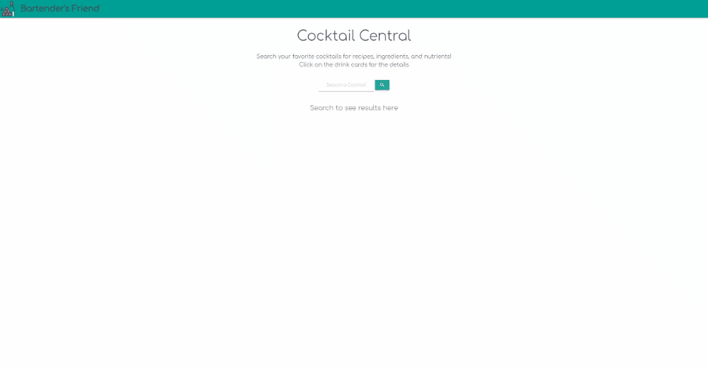

## The Bartender's Friend 

The Bartender's Friend is a web application designed to provide users with recipes and nutritional information on all of their favorite cocktails.

## How It Works

1. User searches for the name of their favorite cocktail.

2. All cocktails containing the name the user searched for are pulled from The Cocktail DB API and displayed on the screen.

3. When one of the cards are clicked, the recipe and nutritional information are displayed for the user at the bottom of the screen.

4. The recipe is pulled from the Cocktail DB API, while the nutritional information is pulled from Nutrionix API.

## Demo

## Authors and Acknowledgement

Ken Dy
Sebastian Meza
Sean Nguyen
William Ramirez

## APIs Used

* The Cocktail DB
* Nutrionix